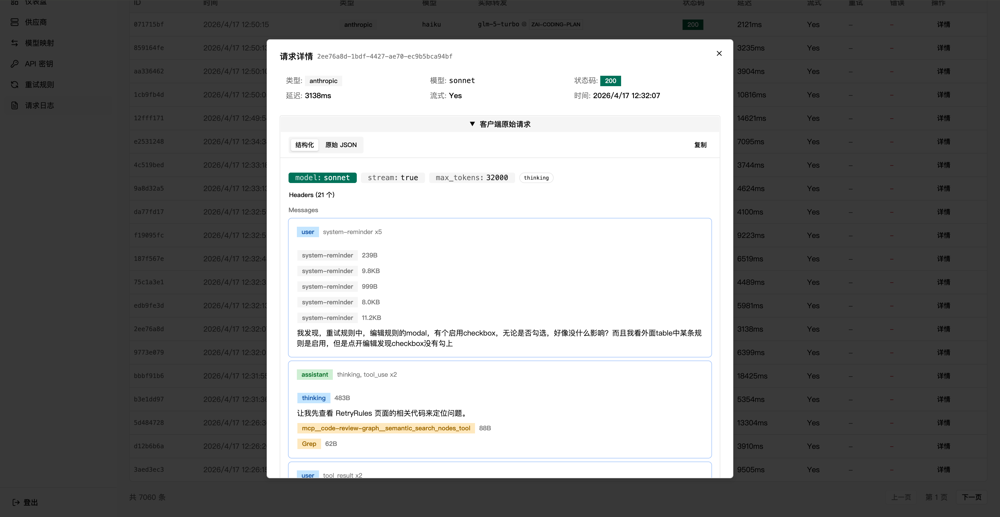
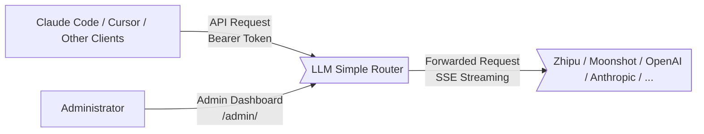
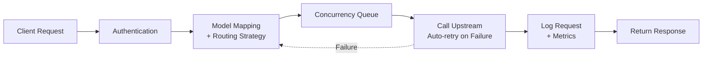

**[English](README.en.md)** | **[中文](README.md)**

# LLM Simple Router

An LLM API proxy router that receives requests from clients like Claude Code and Cursor, forwards them to configured backend Providers through model mapping and routing strategies, supporting both streaming (SSE) and non-streaming proxying.

**Core problem it solves**: Chinese domestic models have frequent rate limits, switching between multiple providers is cumbersome, and concurrency control is missing.

## Who Is This For

- Developers using Claude Code with Chinese domestic models (Zhipu, Moonshot, Minimax, etc.)
- Those who want automatic retries for rate-limit errors, time-based model switching, and concurrency queue management
- Anyone looking for a turnkey solution without the hassle

## Feature Overview

| Feature | Description |
|---------|-------------|
| Automatic retries | Exponential backoff retries for 429/400/network timeouts, pre-configured for Zhipu models by default |
| Multi-provider support | Zhipu, Moonshot, Minimax, Volcano Engine, Alibaba Cloud, Tencent Cloud, etc. Base URL is auto-filled when you select a Coding Plan |
| Time-based model mapping | Automatically switch backend models by time period (e.g., switch to Kimi during peak hours, back to GLM during off-peak) |
| Concurrency queue | Per-Provider concurrency limits with queueing for excess requests |
| Failover | Multiple Providers as backups; automatically switches to the next on failure |
| Real-time monitoring | SSE-based live view of active requests, queue status, and streaming output |
| Multi-key management | Independent API keys + model whitelists for multi-user/multi-project setups |
| Request logs | Full four-stage tracing (client request / upstream request / upstream response / client response) |
| Performance metrics | TTFT, TPS, Token usage, cache hit rate |

> **API Compatibility:** Supports Anthropic-compatible API (adapted for Claude Code). OpenAI-compatible API (`/v1/chat/completions`) is not yet fully tested.

## Admin Dashboard

| Provider Management + Concurrency Control | Real-time Monitoring |
|---|---|
|  |  |

| Model Mapping | Retry Rules |
|---|---|
|  |  |

| Dashboard | Request Logs |
|---|---|
|  |  |

| Proxy Enhancement (Experimental) |
|----------------------------------|
|  |

## Quick Start

### 1. Start the Router

```bash
npx llm-simple-router
```

Visit http://localhost:9981/admin — on first access you'll see the Setup page to set an admin password. Data is stored in `~/.llm-simple-router/`.

### 2. Configure a Provider

Go to Admin Dashboard > Provider page > Add Provider. Select a Coding Plan and the Base URL will be auto-filled — you only need to provide the API Key.

### 3. Configure Model Mapping

Go to Admin Dashboard > Model Mapping page.

**Core concept:** The client sends a request with model name A. The Router replaces it with model name B (supported by the backend Provider) based on mapping rules, then forwards the request:

```
Claude Code (model A) → Router (A → B) → Provider API (model B)
```

Simply configure "client model = A, backend model = B, select provider" in the mapping table.

#### Claude Code Default Model Names

When no environment variables are set, Claude Code uses the following default model names: `opus`, `sonnet`, `haiku`. If the backend is Zhipu Coding Plan, the mapping configuration would be:

| Client Model | Backend Model | Provider | Time Window |
|-------------|---------------|----------|-------------|
| opus | glm-5.1 | Zhipu Coding Plan | All day |
| sonnet | glm-5.1 | Zhipu Coding Plan | All day |
| haiku | glm-5-turbo | Zhipu Coding Plan | All day |

You can also use time-based mapping to auto-switch during peak hours:

| Client Model | Backend Model | Provider | Time Window |
|-------------|---------------|----------|-------------|
| sonnet | glm-5.1 | Zhipu Coding Plan | 00:00-14:00 |
| sonnet | kimi-for-coding | Moonshot | 14:00-18:00 |
| sonnet | glm-5.1 | Zhipu Coding Plan | 18:00-24:00 |

### 4. Configure Claude Code

Create a Router API key in the admin dashboard, then choose one of the following methods. **You only need one of the two.**

**Method 1: Shell alias (recommended)**

Minimal configuration — Claude Code uses default model names (opus / sonnet / haiku), and the Router converts them via the mapping table:

```bash
alias clode='\
export ANTHROPIC_AUTH_TOKEN="<your-router-key>" && \
export ANTHROPIC_BASE_URL="http://127.0.0.1:9981" && \
claude'
```

You can also specify model names directly via environment variables, bypassing Router mapping:

```bash
alias clode='\
export ANTHROPIC_AUTH_TOKEN="sk-router-xxxxxxxx" && \
export ANTHROPIC_BASE_URL="http://192.168.1.111:9981" && \
export ANTHROPIC_MODEL="glm-5" && \
export ANTHROPIC_DEFAULT_OPUS_MODEL="glm-5.1" && \
export ANTHROPIC_DEFAULT_SONNET_MODEL="glm-5" && \
export ANTHROPIC_DEFAULT_HAIKU_MODEL="glm-5-turbo" && \
export ANTHROPIC_SMALL_FAST_MODEL="glm-5-turbo" && \
claude'
```

> For debugging, add flags: `claude --dangerously-skip-permissions --verbose --debug`, or set `export DEBUG=claude:*` for detailed logs.

**Method 2: ~/.claude/settings.json**

Configure in the `env` field of `~/.claude/settings.json` — same effect as exporting environment variables:

Minimal configuration:

```json
{
  "env": {
    "ANTHROPIC_AUTH_TOKEN": "<your-router-key>",
    "ANTHROPIC_BASE_URL": "http://127.0.0.1:9981"
  }
}
```

Override model names:

```json
{
  "env": {
    "ANTHROPIC_AUTH_TOKEN": "sk-router-xxxxxxxx",
    "ANTHROPIC_BASE_URL": "http://192.168.1.111:9981",
    "ANTHROPIC_MODEL": "glm-5",
    "ANTHROPIC_DEFAULT_OPUS_MODEL": "glm-5.1",
    "ANTHROPIC_DEFAULT_SONNET_MODEL": "glm-5",
    "ANTHROPIC_DEFAULT_HAIKU_MODEL": "glm-5-turbo",
    "ANTHROPIC_SMALL_FAST_MODEL": "glm-5-turbo"
  }
}
```

> Environment variables in settings.json apply to all projects. To apply only to the current project, place them in `.claude/settings.json` (in the project root).

### 5. Usage

```bash
# Method 1 (shell alias)
clode

# Method 2 (settings.json)
claude
```

## Docker Deployment

```bash
docker compose up -d
```

Environment variables are configured through the Setup page — no `.env` file needed.

## Process Management

After upgrading via the Web UI, the service needs to restart to take effect. Use one of the following deployment methods to ensure automatic recovery after crashes or upgrade restarts.

### PM2 (Recommended)

```bash
# Install PM2
npm install -g pm2

# Install Router globally
npm install -g llm-simple-router

# Start (PM2 auto-restarts crashed processes)
pm2 start llm-simple-router --name llm-router

# View logs
pm2 logs llm-router

# Enable startup on boot
pm2 startup
pm2 save
```

Upgrade flow: Web UI one-click upgrade → click restart → PM2 auto-spawns new process (< 1s downtime).

### systemd (Linux Servers)

Create a service file at `/etc/systemd/system/llm-simple-router.service`:

```ini
[Unit]
Description=LLM Simple Router
After=network.target

[Service]
Type=simple
ExecStart=/usr/local/bin/llm-simple-router
Restart=always
RestartSec=3
Environment=PORT=9981
Environment=LOG_LEVEL=info
# Configure other environment variables as needed
# Environment=DB_PATH=/var/lib/llm-simple-router/router.db

[Install]
WantedBy=multi-user.target
```

> **Note:** The `ExecStart` path depends on how Node.js is installed. Use `which llm-simple-router` to confirm the actual path.

```bash
# Enable and start
sudo systemctl enable llm-simple-router
sudo systemctl start llm-simple-router

# View status and logs
sudo systemctl status llm-simple-router
journalctl -u llm-simple-router -f
```

Upgrade flow: Web UI one-click upgrade → click restart → systemd auto-restarts (< 1s downtime).

### npx / Manual Start

No extra configuration needed. After upgrading via Web UI and clicking restart, the Router automatically spawns a new process and exits the old one. Brief interruption of about 1-2 seconds.

> **Note:** If you directly `Ctrl+C` or close the terminal, the service won't auto-recover. For production, use PM2 or systemd.

## How It Works

```
Claude Code → Router (model mapping + auto-retry + concurrency control) → Zhipu GLM / Kimi / Other Providers
```

The Router finds the backend provider via model mapping → forwards the request → auto-retries failed requests → logs and records performance metrics → returns the response.

### Architecture Diagram

**System Context** ([detailed description](docs/system-context.md)):



**Request Processing Pipeline** ([detailed description](docs/request-pipeline.md)):



When the Router receives a request: Authentication → find backend Provider via mapping rules → queue for concurrency control → forward to upstream (auto-retry on failure; under Failover strategy, switches Provider) → log and record metrics → return response.

## Environment Variables

All secrets are configured through the Setup page. The following are optional configurations:

| Variable | Default | Description |
|----------|---------|-------------|
| `PORT` | `9981` | Service port |
| `DB_PATH` | `~/.llm-simple-router/router.db` | SQLite database path |
| `LOG_LEVEL` | `info` | Log level |
| `TZ` | `Asia/Shanghai` | Timezone setting |
| `STREAM_TIMEOUT_MS` | `3000000` | Streaming proxy idle timeout (ms) |
| `RETRY_MAX_ATTEMPTS` | `3` | Maximum retry attempts |
| `RETRY_BASE_DELAY_MS` | `1000` | Retry base delay (ms) |

## Development

```bash
# Backend (hot reload)
npm run dev

# Frontend (hot reload, proxies API to backend :9980)
cd frontend && npm run dev

# Build
npm run build:full

# Test
npm test

# Lint
npm run lint
```

## License

MIT
